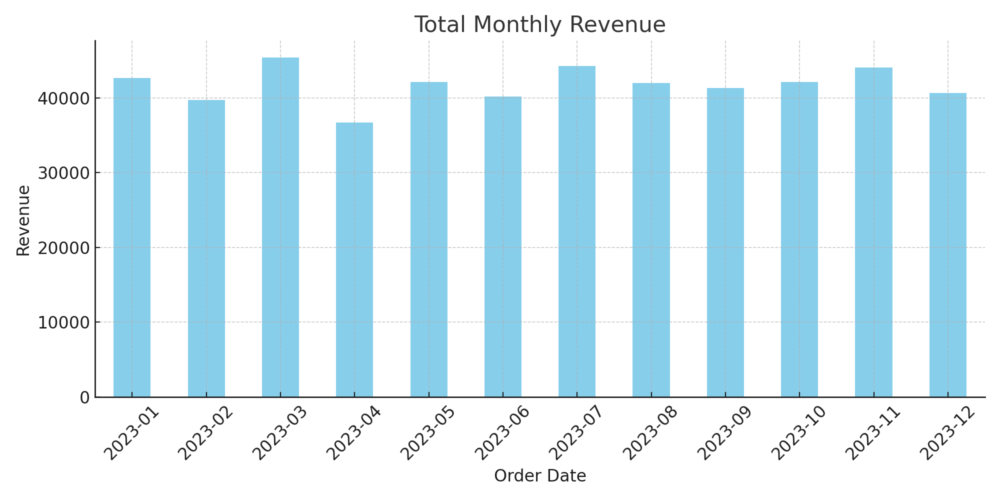
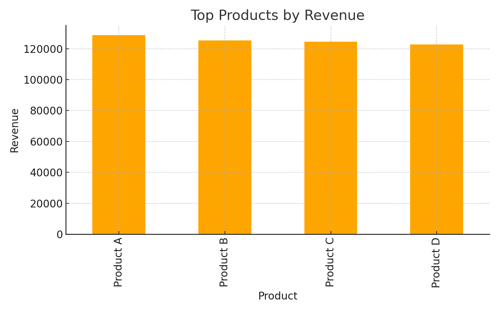
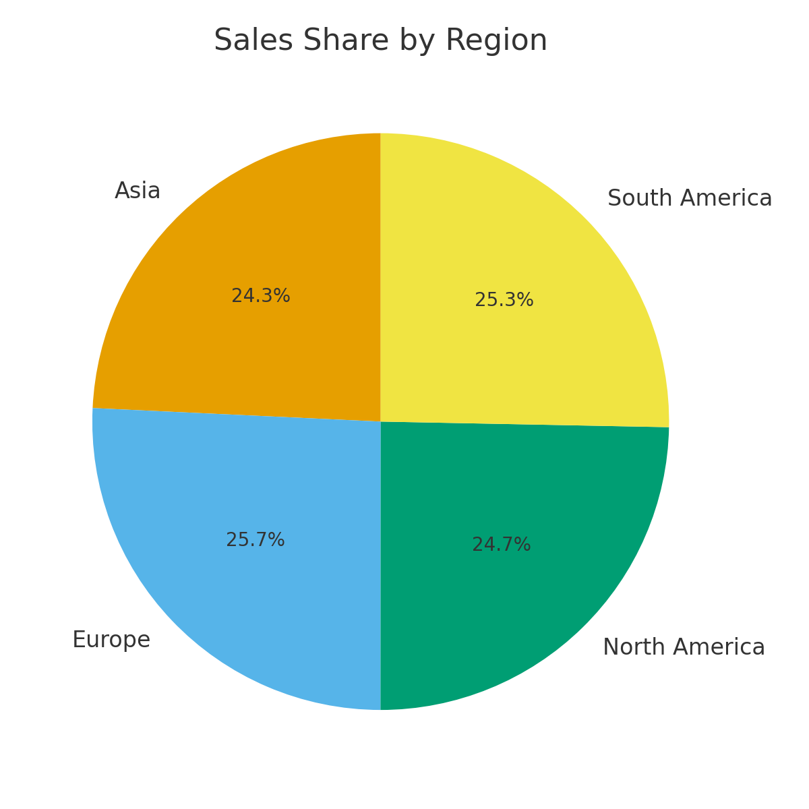

# 📊 Sales Data Analysis

## 📌 Overview
This project analyzes a company's sales data to extract key insights about revenue, top-selling products, seasonal patterns, and regional performance.

## 🔑 Dataset
- **Columns:**
  - Order ID
  - Product
  - Quantity
  - Price
  - Order Date
  - Region  

## 🛠️ Steps
1. Data cleaning (date conversion, new revenue column).  
2. Exploratory Data Analysis (EDA).  
3. Visualization using Matplotlib & Seaborn.  

## 📈 Key Insights
- Total revenue generated: **X USD**  
- Best-selling product: **Product A**  
- Highest revenue month: **December**  
- Region with highest sales: **North America**  

## 🖼️ Visualizations
- Monthly Sales Trends  
  

- Top Products by Revenue  
  

- Sales by Region  
  

---

## 🚀 Tools
- Python  
- Pandas  
- Matplotlib  
- Seaborn
